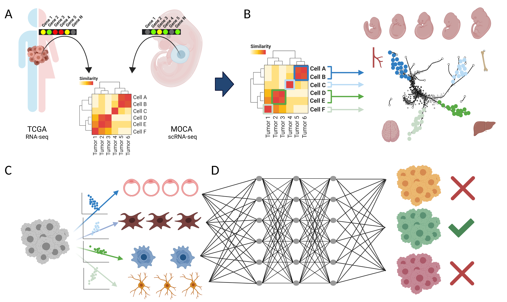

# A Developmental Deconvolution Multilayer Perceptron for Classification of Cancer Origin

**Graphical Abstract**

## Project Overview

Cancer is a disease manifesting in abrogation of developmental programs, and malignancies are named based on their cell or tissue of origin. However, a systematic atlas of tumor origins is lacking. 

Here we map the single cell organogenesis of 56 developmental trajectories to the transcriptomes of over 10,000 tumors across 33 cancer types. We use this map to deconvolute individual tumors into their constituent developmental trajectories. Based on these deconvoluted developmental programs, we construct a Developmental Multilayer Perceptron (D-MLP) classifier that outputs cancer origin. 

The D-MLP classifier (ROC-AUC: 0.974 for top prediction) outperforms classification based on expression of either oncogenes or highly variable genes. We analyze tumors from patients with cancer of unknown primary (CUP), selecting the most difficult cases where extensive multimodal workup yielded no definitive tumor type. D-MLP revealed insights into developmental origins and diagnosis for most patient tumors.

Our results provide a map of tumor developmental origins, provide a tool for diagnostic pathology, and suggest developmental classification may be a useful approach for otherwise unclassified patient tumors. 

## Code Overview

The code folder contains the scripts used to generate the analysis and figures shown in Moiso et al. *(add url here)*.
The scripts in the code are written in **R**, **shell** and **Python** and requires the following packages:

### R

[R](https://www.r-project.org/) version 3.5.1 or older is required with the following libraries:

* [data.table](https://cran.r-project.org/web/packages/data.table/index.html)
* [Matrix](https://cran.r-project.org/web/packages/Matrix/index.html) 
* [ggplot2](https://cran.r-project.org/web/packages/ggplot2/index.html)
* [ggpubr](https://cran.r-project.org/web/packages/ggpubr/index.html)
* [pheatmap](https://cran.r-project.org/web/packages/pheatmap/index.html)
* [ggalluvial](https://cran.r-project.org/web/packages/ggalluvial/index.html)
* [RColorBrewer](https://cran.r-project.org/web/packages/RColorBrewer/index.html)
* [reshape2](https://cran.r-project.org/web/packages/reshape2/index.html)
* [viridis](https://cran.r-project.org/web/packages/viridis/index.html)
* [scales](https://cran.r-project.org/web/packages/scales/index.html)
* [alluvial](https://cran.r-project.org/web/packages/alluvial/index.html)
* [lsa](https://cran.r-project.org/web/packages/lsa/index.html)
* [umap](https://cran.r-project.org/web/packages/umap/index.html)
* [parallel](https://stat.ethz.ch/R-manual/R-devel/library/parallel/doc/parallel.pdf)
* [grDevices](https://www.rdocumentation.org/packages/grDevices/versions/3.6.2)

And the following [Bioconductor](https://www.bioconductor.org/install/) package

* [limma](https://www.bioconductor.org/packages/release/bioc/html/limma.html)

### Shell

shell scripts are used for fastq reads analysis, and require the following softwares:

* [STAR](https://github.com/alexdobin/STAR) v2.7.1a
* [RSEM](https://github.com/deweylab/RSEM) v1.3.1

### Python

[Python](https://www.python.org/) version 3.6.4 is used to generate and evalaute the MLP models and the following modules and libraries are required:

* keras 2.2.0
* numpy 1.19.5
* scikit-learn 0.19.1
* sys
* tensorflow 1.5.0

## Docker

To easily reproduce the analysis and the figures of our work we dockerized the environment we used in the paper.         
This requires you to have [Docker](https://www.docker.com/) installed on your system. If you don't **don't panic**, it is super simple, just follow these instructions for [Linux](https://docs.docker.com/desktop/linux/install/), [Mac](https://docs.docker.com/desktop/mac/install/) or [Windows](https://docs.docker.com/desktop/windows/install/)

When `Docker` is up and running you can clone this git repository with:

	git clone https://github.com/emoiso/DevTum.git

After cloning the git you can assemble the image with following command:

	cd DevTum
	sudo docker build -t devtum .

After the `devtum` image has been succesfully build, you can test by runing:

	sudo docker run --entrypoint code/figs7b.R -v $PWD:/home devtum

The previous command will generate the umap shown in figure S7

If you encounter any problems, bugs or have any question, please contact Enrico Moiso (em.metaminer@gmail.com).

Created and maintained by Enrico Moiso. Last update 07/11/2022.

